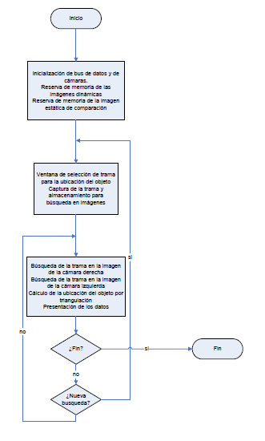
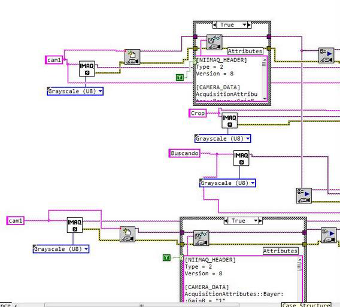
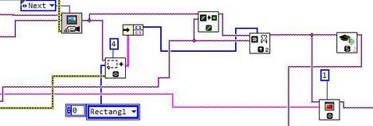
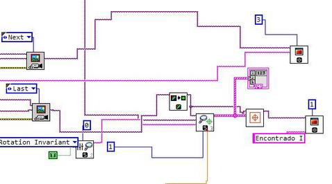
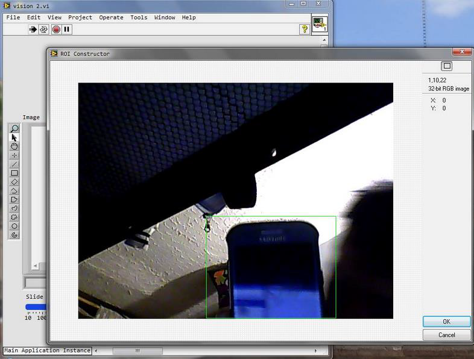
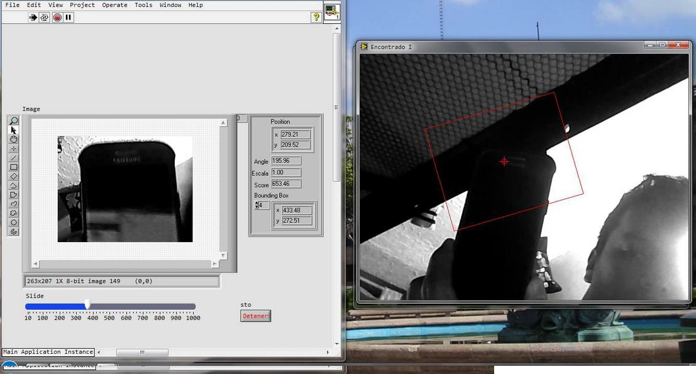

# PATTERN SEARCH
---
## Author: Juan Carlos Gonzalez

## Email: jcgi.laboral@gmail.com

## Date: December 2023

---

---
## Table of Contents

- [Introduction](#introduction)
- [Defining the problem](#problem-definition)
- [Objectives](#objectives) 
    - [General objective](#general-objective) 
    - [Specific objective](#specific-objective) 
- [Theoretical Framework](#theoretical-framework) 
    - [Model or pattern](#model-or-pattern) 
    - [Pattern Search](#pattern-search) 
- [Introduction to Language](#introduction-to-language) 
    - [The language](#the-language)
- [Development](#development) 
    - [The algorithm](#the-algorithm)
    - [The program](#the-program) 
- [Results](#results) 
- [Conclusions](#conclusions) 
- [Bibliography](#bibliography)

---

## Introduction

Searching for patterns using a webcam with LabVIEW, which searches for a particular pattern within an environment. This project was carried out with the purpose of researching artificial vision to determine in which sectors we can use our project in the future.

LabVIEW is a graphical tool for testing, controlling, and designing through programming. The language it uses is called G language. The method used for our pattern search is through vectorization, which consists of representing the images as vectors, thus facilitating our search.

The limitations of our project are that it only covers images or video for pattern recognition.

## Problem Definition

The problem is that a given pattern must be found within a specific environment, which will be captured by a webcam. When the camera finds the pattern, the application must show the location and determine that it is the same pattern that appeared initially.

## Objectives

### General Objective

Search for a pattern within a given environment, either by video or images, to interpret photographs, recognize images, faces, objects, etc.

### Specific Objective

Find a specific pattern using a webcam and LabVIEW.

## Theoretical Framework

Pattern recognition, also called pattern reading, figure identification, and shape recognition, involves recognizing signal patterns. The patterns are obtained from segmentation, feature extraction, and description processes, where each object is represented by a collection of descriptors. The recognition system assigns each object a category or class (a set of entities that share some distinguishing characteristic).

To recognize patterns, the following processes are followed:

- Data acquisition
- Feature extraction
- Decision making

The essential point of pattern recognition is **classification**: signals are classified depending on their characteristics. For example, digital images of letters can be classified in classes "A" to "Z" based on their pixels, or bird songs can be classified based on frequency.

### Model or Pattern

A model is a global description of a dataset, while a pattern is a local property of the data. A pattern is formed from a combination of properties (x₁, x₂, ..., xₙ), defining a property space in which the classifier operates.

The classifier does not recognize objects but rather the pattern that defines the object. If the pattern is known, the object is recognized.

## Pattern Search

A complete pattern recognition system consists of:

- A sensor to collect observations
- A feature extraction system that transforms observations into numerical or symbolic values
- A classification or description system that classifies the measurement based on the extracted features

For example, digital images of letters can be classified into classes "A" to "Z", or fingerprints can be classified.

### Image characteristics

- **Topological**: number of related components, holes
- **Geometric**: area, perimeter, curvature
- **Statistics**: moments

A **pattern** is a set of characteristics, and a **class of patterns** is a set of "similar" patterns. The goal is to assign a pattern to the correct class as automatically as possible.

## Introduction to Language

LabVIEW is a graphical tool for testing, controlling, and designing through programming. The language it uses is called G language. This program was created by National Instruments and was first released in 1986. Now it is available for multiple platforms such as Windows, UNIX, and Linux.

LabVIEW's programs are called VI (Virtual Instrument), which hints at its original use for instrument control. LabVIEW's motto is: *"The power is in the Software."*

### Main uses:

- Data acquisition
- Instrument control
- Industrial automation (PAC)
- Control design (rapid prototyping, hardware-in-the-loop)
- Embedded design

The G language is high-level when used through its drag-and-drop graphical interface, although it also supports other languages like C#, C++, and Java.

## Development

### The Algorithm

A generic diagram of the algorithm is presented below:

1. Device and memory initialization
2. Frame specification and storage for searches
3. Search within the frames
4. End search loop or start a new search

### The Program

1. Memory reserve and camera setup

2. Frame selection and storage

3. Searching for the pattern in the images

4. Exit blocks for the search and program

## Results

First, using the webcam, a photo is taken where the pattern to search for is selected. Once cut, the pattern is displayed on the left, and the search begins on the right window.

## Conclusions

The project yielded the expected results by successfully finding the patterns. With further development, it could be used to recognize faces, fingerprints, or detect imperfections in materials in industry.

## Bibliography

1. [Computer Vision: Luis Baumela](http://www.dia.fi.upm.es/~lbaumela/Alcala) - Department of Artificial Intelligence, Polytechnic University of Madrid
2. [Bionics](http://es.wikipedia.org/wiki/Biónica) - Accessed November 30, 2014
3. [Artificial Vision](http://es.wikipedia.org/wiki/Visión_artificial) - Accessed November 30, 2014
4. **Image Processing with LabVIEW and IMAQ Vision** by Thomas Kilinger - Prentice Hall PTR
